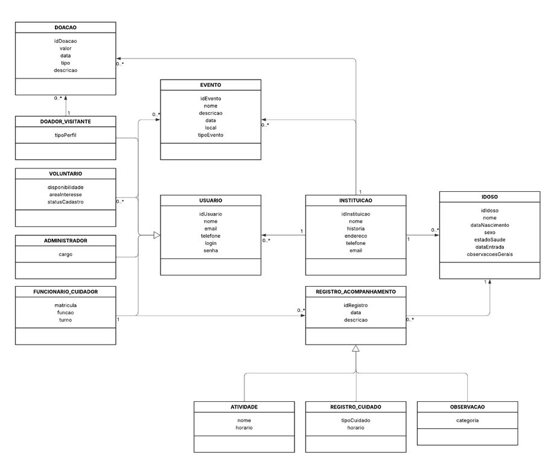

# Especificação Principal

## Objetivo

Desenvolver um sistema web utilizando Python, Django e banco de dados SQLite para organizar e centralizar as informações da ONG ACITP. O sistema deve facilitar o registro de doações, o gerenciamento de voluntários, a divulgação de eventos e a transparência das atividades da instituição.

## Problema

A ONG ACITP tem dificuldade em centralizar e organizar informações essenciais para captação e prestação de contas. Dados sobre doações, contatos, voluntários e eventos ficam dispersos em mensagens, planilhas, anotações ou redes sociais.

Essa dispersão gera:

- Perda de histórico e retrabalho, como doadores e voluntários repetidos sem controle.
- Dificuldade para responder rapidamente a interessados.
- Baixa previsibilidade de arrecadação por falta de registro estruturado.
- Transparência limitada, sem um local padronizado para prestação de contas.
- Pouca visibilidade digital, já que informações importantes não ficam organizadas em um canal oficial único.

## Solução

Com Django e SQLite, o sistema cria dados estruturados com cadastro, consulta e atualização.

A solução contempla:

- Cadastro e gestão de doações, com tipo, valor, data, descrição e histórico consultável.
- Cadastro de voluntários, com informações de contato e dados úteis para acompanhamento.
- Divulgação centralizada de eventos, campanhas e ações sociais.
- Transparência institucional com publicação organizada de informações e prestações de contas.
- Administração dos dados pelo painel administrativo do Django.

## Requisitos Funcionais

- **RF01:** O sistema deve permitir o cadastro e o gerenciamento de doações, registrando tipo de doação, data, descrição, valor ou item doado.
- **RF02:** O sistema deve permitir o cadastro de voluntários, armazenando dados de contato e informações relevantes para acompanhamento.
- **RF03:** O sistema deve disponibilizar uma área para divulgação de eventos, campanhas de arrecadação e ações sociais promovidas pela ONG.
- **RF04:** O sistema deve apresentar informações institucionais da ACITP, incluindo endereço, contatos, redes sociais e formas de doação.
- **RF05:** O sistema deve permitir que administradores atualizem e gerenciem os dados cadastrados.
- **RF06:** O sistema deve disponibilizar um meio de contato entre visitantes e a instituição.
- **RF07:** O sistema deve apoiar a prestação de contas e a transparência institucional por meio da exibição organizada das ações e informações relevantes da ONG.

## Requisitos Não Funcionais

- **RNF01 - Desempenho:** A aplicação deve apresentar tempo de resposta adequado para navegação, consulta e cadastro de informações.
- **RNF02 - Usabilidade:** A interface deve ser intuitiva, simples e de fácil utilização.
- **RNF03 - Compatibilidade:** O sistema deve funcionar nos principais navegadores atuais e em computadores, tablets e smartphones.
- **RNF04 - Segurança:** Os dados devem ser protegidos por autenticação, controle de acesso e validação de entradas.
- **RNF05 - Manutenibilidade:** A solução deve ser organizada para facilitar correções, atualizações e expansões futuras.
- **RNF06 - Confiabilidade:** O sistema deve garantir integridade no armazenamento e recuperação das informações.

## Mini Mundo

A Casa do Idoso para Todos os Povos, ACITP, é uma organização sem fins lucrativos dedicada ao acolhimento e cuidado de idosos em situação de vulnerabilidade.

A instituição oferece moradia, alimentação, acompanhamento diário e atividades que buscam garantir dignidade, bem-estar e qualidade de vida aos residentes.

O sistema da ONG tem como objetivo organizar informações sobre voluntários, doações e eventos promovidos pela instituição.

Existem quatro principais tipos de usuários:

- **Administradores:** responsáveis pela gestão geral da plataforma, cadastro e atualização de informações institucionais, eventos, campanhas, voluntários, administradores e doações.
- **Voluntários:** podem se cadastrar para participar das atividades da instituição e consultar eventos ou ações sociais programadas.
- **Doadores:** podem conhecer a história da instituição, acompanhar campanhas e registrar doações financeiras.
- **Visitantes:** podem conhecer a ONG, visualizar atividades, acompanhar campanhas e acessar informações de doação.

Além disso, o sistema auxilia na organização de eventos e campanhas solidárias, como celebrações de Natal, campanhas de arrecadação e ações comunitárias.

## Schema do Banco de Dados

## Casos de Uso

### Administrador

- Cadastrar voluntário.
- Cadastrar e atualizar informações da instituição.
- Gerenciar eventos e campanhas.
- Cadastrar administrador.
- Gerenciar registros de doações.
- Gerenciar prestações de contas.

### Voluntário

- Cadastrar-se como voluntário.
- Consultar eventos e ações sociais.

### Doador

- Conhecer a história da instituição.
- Visualizar atividades realizadas.
- Acompanhar campanhas de arrecadação.
- Registrar doação financeira.

### Visitante

- Conhecer a história da instituição.
- Visualizar atividades realizadas.
- Acompanhar campanhas de arrecadação.
- Registrar doação financeira.

